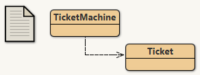
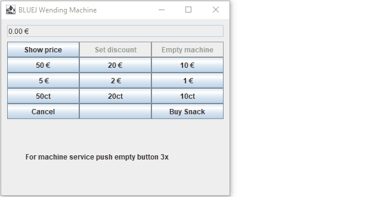

Purpose of project: To illustrate the basics of fields, constructors, and methods.

Description from the project:
 WendingMachine models a naive wending machine that dispenses some snacks.
 Git user n-c0de-r updated this naive machine to an improved one, for
 showcasing purposes. This improved machine only accepts certain coins and
 will return inappropriate amounts and set prices right as n-c0de-r
 implemented all guards needed to solve that. Compared to the original
 machine, this has a few extra methods to do so correctly. The price of a
 snack is specified via the constructor.

  Based on the original by David J. Barnes and Michael Kölling
  @author n-c0de-r
  @version 2023.02.05
  
  Updated to have a GUI. This can still be improved!
  
  
