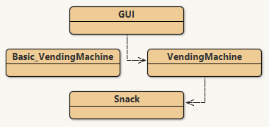

Project: naive-ticket-machine
Authors: David Barnes and Michael Kölling

This project is part of the material for the book

   Objects First with Java - A Practical Introduction using BlueJ
   Sixth edition
   David J. Barnes and Michael Kölling
   Pearson Education, 2016

It is discussed in chapter 2.

Purpose of project: To illustrate the basics of fields, constructors, and methods.
How to start this project: Create one or more TicketMachine objects.

Description from the project:
  TicketMachine models a naive ticket machine that issues
  flat-fare tickets. Git user n-c0de-r uprated this naive
  machine to an improved one, for showcase purposes.
  This improved machine only accepts certain coins and
  will return inapropriate amounts and set prices right
  as n-c0de-r implemented all guards needed to solve that.
  Compared to the original machine, this has a few extra
  methods to do so correctly.
  The price of a ticket is specified via the constructor.

  @author David J. Barnes and Michael Kölling
  @version 2016.02.29
  @author n-c0de-r
  @version 2021.07.20
  
  Updated to have a GUI.
  
  
